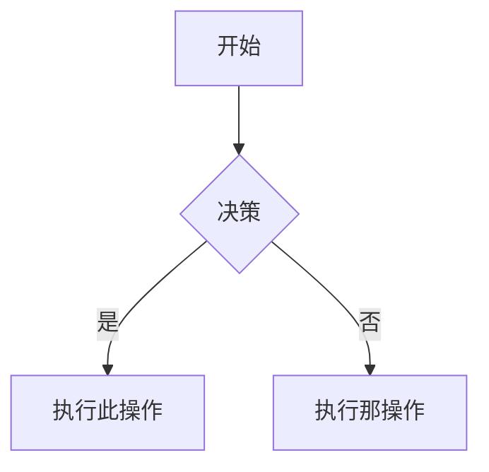

# Obsidian 风格 Markdown 技能

创建和编辑有效的 Obsidian 风格 Markdown。Obsidian 在 CommonMark 和 GFM 的基础上扩展了 wikilinks、嵌入、提示框、属性、注释及其他语法。本技能仅涵盖 Obsidian 特定的扩展功能——标准 Markdown（标题、粗体、斜体、列表、引用、代码块、表格）被视为基础知识。

## 创建 Obsidian 笔记

- **添加前置内容**，在文件顶部使用属性（标题、标签、别名）。所有属性类型请参阅 [PROPERTIES.md](references/PROPERTIES.md)。
- **编写内容**，使用标准 Markdown 构建结构，并结合下方介绍的 Obsidian 特定语法。
- **链接相关笔记**，使用 wikilinks（`[[Note]]`）进行内部仓库连接，或使用标准 Markdown 链接指向外部 URL。
- **嵌入内容**，使用 `![[embed]]` 语法嵌入其他笔记、图片或 PDF。所有嵌入类型请参阅 [EMBEDS.md](references/EMBEDS.md)。
- **添加提示框**，使用 `> [!type]` 语法突出显示信息。所有提示框类型请参阅 [CALLOUTS.md](references/CALLOUTS.md)。
- **添加后置内容**，在文件底部添加后置内容。所有后置内容类型请参阅 [POSTCONTENT.md](references/POSTCONTENT.md)。
- **验证**，确保笔记在 Obsidian 阅读视图中正确渲染。

> 在选择 wikilinks 和 Markdown 链接时：对于仓库内的笔记使用 `[[wikilinks]]`（Obsidian 会自动跟踪重命名），外部 URL 仅使用 `[text](url)`。

## 内部链接（Wikilinks）

```markdown
[[Note Name]]                          链接到笔记
[[Note Name|Display Text]]             自定义显示文本
[[Note Name#Heading]]                  链接到标题
[[Note Name#^block-id]]                链接到块
[[#Heading in same note]]              同一笔记内的标题链接
```

通过在任意段落末尾添加 `^block-id` 来定义块 ID：

```markdown
此段落可以被链接。 ^my-block-id
```

对于列表和引用，将块 ID 放在块之后的单独行：

```markdown
> 引用块

^quote-id
```

## 嵌入

在任何 wikilink 前加 `!` 可将其内容嵌入到行内：

```markdown
![[Note Name]]                         嵌入完整笔记
![[Note Name#Heading]]                 嵌入章节
![[image.png]]                         嵌入图片
![[image.png|300]]                     嵌入指定宽度的图片
![[document.pdf#page=3]]               嵌入 PDF 页面
```

音频、视频、搜索嵌入和外部图片请参阅 [EMBEDS.md](references/EMBEDS.md)。

## 提示框

```markdown
> [!note]
> 基本提示框。

> [!warning] 自定义标题
> 带自定义标题的提示框。

> [!faq]- 默认折叠
> 可折叠的提示框（- 折叠，+ 展开）。
```

常用类型：`note`、`tip`、`warning`、`info`、`example`、`quote`、`bug`、`danger`、`success`、`failure`、`question`、`abstract`、`todo`。

自定义 CSS 提示框、别名、嵌套的完整列表请参阅 [CALLOUTS.md](references/CALLOUTS.md)。

## 属性（前置内容）

```yaml
---
title: 我的笔记
date: 2024-01-15 14:08:11
updated: 2024-01-15 14:08:11
tags:
  - project
  - active
keywords:
  - 备选名称
---
```

所有属性类型、标签语法规则和高级用法请参阅 [PROPERTIES.md](references/PROPERTIES.md)。

属性中的 `date` 和 `updated` 格式为 `YYYY-MM-DD HH:MM:SS`，要包括年月日时分秒。

如果无法获取当前具体时间（只能得到日期），可以用命令行在生成阶段获取当前时间字符串，再写入 frontmatter，请根据系统选择合适的命令：

适用于 Linux 和 macOS 系统：

```bash
date "+%Y-%m-%d %H:%M:%S"
```

适用于 Windows 系统：

```powershell
Get-Date -Format "yyyy-MM-dd HH:mm:ss"
```

## 后置内容

```markdown
## 相关链接

[参考网络文献](https://example.com)

[Github 仓库](https://example.com)

## OB links

[[JDK 21 新特性]]

## OB tags

#java #jdk
```

后置内容请参阅 [POSTCONTENT.md](references/POSTCONTENT.md)。

## 标签

```markdown
#tag                    行内标签
#nested/tag             带层级结构的嵌套标签
```

标签可包含字母、数字（首字符不能是数字）、下划线、连字符和正斜杠。标签也可以在前置内容的 `tags` 属性下定义。

## 注释

```markdown
这是可见的 %%但这部分是隐藏的%% 文本。

%%
整个块在阅读视图中都是隐藏的。
%%
```

## Obsidian 特定格式

```markdown
==高亮文本==                        高亮语法
```

## 数学公式（LaTeX）

```markdown
行内公式: $e^{i\pi} + 1 = 0$

块级公式:
$$
\frac{a}{b} = c
$$
```

## 图表（Mermaid）

````markdown

````

要将 Mermaid 节点链接到 Obsidian 笔记，请添加 `class NodeName internal-link;`。

## 脚注

```markdown
带脚注的文本[^1]。

[^1]: 脚注内容。

行内脚注。^[这是行内脚注。]
```

## 完整示例

````markdown
---
title: Alpha 项目
date: 2024-01-15 14:08:11
updated: 2024-01-15 14:08:11
tags:
  - project
  - active
---

# Alpha 项目

本项目旨在使用现代技术 [[改进工作流程]]。

> [!important] 关键截止日期
> 第一个里程碑截止日期是 ==1月30日==。

## 任务

- [x] 初步规划
- [ ] 开发阶段
  - [ ] 后端实现
  - [ ] 前端设计

## 笔记

该算法使用 $O(n \log n)$ 排序。详见 [[算法笔记#排序]]。

![[架构图.png|600]]

在 [[2024-01-10 会议笔记#决策]] 中审核。

## 相关链接

[参考网络文献](https://example.com)

[Github 仓库](https://example.com)

## OB links

[[JDK 21 新特性]]

## OB tags

#java #jdk

````

## 参考资料

- [Obsidian 风格 Markdown](https://help.obsidian.md/obsidian-flavored-markdown)
- [内部链接](https://help.obsidian.md/links)
- [嵌入文件](https://help.obsidian.md/embeds)
- [提示框](https://help.obsidian.md/callouts)
- [属性](https://help.obsidian.md/properties)
